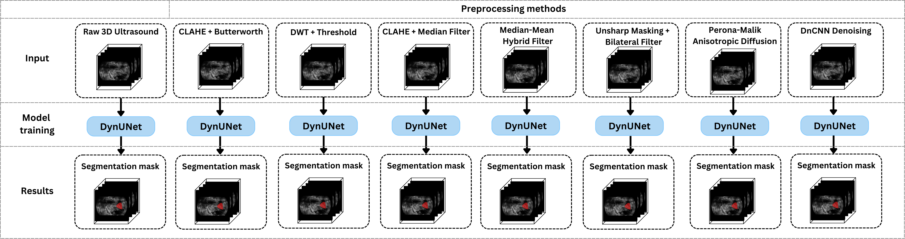
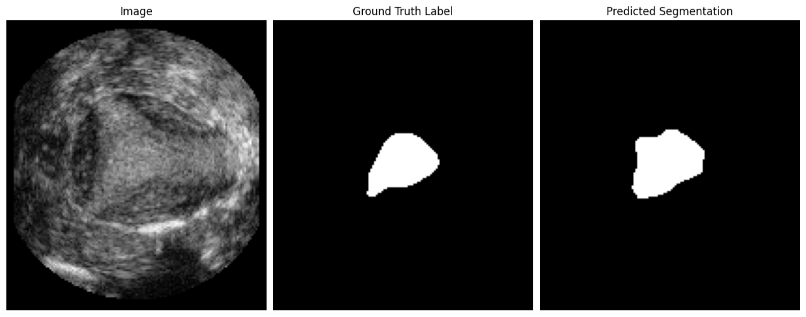

# Evaluating Denoising Methods for 3D Ultrasound Uterus Segmentation with DynUNet

This repository contains the code and experimental pipeline from our ELMAR 2025 paper, which investigates the effect of various denoising techniques on the segmentation accuracy of the uterus in 3D transvaginal ultrasound images.

## Overview

Accurate segmentation of the uterus from 3D ultrasound (US) is critical for reproductive health analysis but remains a challenge due to speckle noise, low contrast, and anatomical variability. We propose a fully automatic deep learning pipeline using [DynUNet](https://docs.monai.io/en/latest/) and evaluate **seven denoising strategies** to enhance input quality prior to segmentation.



## Key Contributions

* Developed a robust **DynUNet-based segmentation** pipeline for 3D uterus ultrasound images.
* Benchmarked **7 denoising methods**:

  * CLAHE + Butterworth
  * DWT + Threshold
  * CLAHE + Median Filter
  * Median–Mean Hybrid Filter
  * Unsharp Masking + Bilateral Filter
  * Perona–Malik Anisotropic Diffusion
  * 3D DnCNN (Deep CNN denoiser)
* Achieved **+11.35% DSC improvement** on test set using 3D DnCNN compared to baseline (from **60.60%** to **71.95%**).
* Evaluated on the [UterUS dataset](https://github.com/UL-FRI-LGM/UterUS) with 5-fold cross-validation.

## Results Snapshot

| Preprocessing               | Test DSC (%) |
| --------------------------- | ------------ |
| No preprocessing (baseline) | 60.60        |
| DnCNN (deep learning)       | **71.95**    |
| DWT + Threshold             | 69.61        |
| CLAHE + Median              | 65.42        |
| CLAHE + Butterworth         | 64.36        |
| Perona–Malik Diffusion      | 64.40        |
| Unsharp + Bilateral         | 56.70        |
| Median–Mean Hybrid          | 50.43        |




## Getting Started

Clone the repo and follow our training and inference scripts to reproduce the experiments.

git clone https://github.com/medi-train/3D-Ultrasound-Denoising-Segmentation.git

Trained models can be downloaded here:

https://puh.srce.hr/s/oLi4JDNK4GaHAdq

## UterUS Dataset

Used UterUS dataset can be downloaded here:

https://github.com/UL-FRI-LGM/UterUS

## Citation

If you use this code or dataset, please cite:

```
@inproceedings{habijan2025elmar,
  title     = {Evaluating Denoising Methods for 3D Ultrasound Uterus Segmentation with DynUNet},
  author    = {Marija Habijan and Juraj Perić and Irena Galić},
  booktitle = {Proceedings of the ELMAR Conference},
  year      = {2025}
}
```

## 🙌 Acknowledgments

This work is supported by the Croatian Science Foundation (project IP-2024-05-9492). We thank UL-FRI-LGM for providing the UterUS dataset.

---


